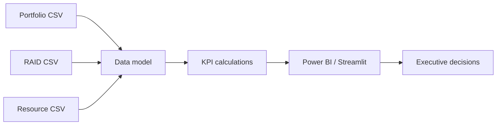

# Operational KPI & Delivery Analytics Portfolio

A synthetic delivery analytics case study showing how project and operations data can be transformed into an executive view using **Power BI concepts, DAX measures, Excel-ready datasets and a lightweight Streamlit dashboard**.

## Business problem

Raw project trackers usually contain dates, owners, budgets and statuses but do not immediately answer:

- Which projects are slipping against baseline?
- Which workstreams carry the most delivery risk?
- Where are blockers and dependencies aging?
- Is budget consumption aligned with delivery progress?
- Which items require management action this week?

This project creates a small reporting model to answer those questions.

## KPI model

| KPI | Definition |
|---|---|
| Milestone variance | Forecast finish minus baseline finish |
| On-time rate | Projects with forecast finish <= baseline finish / total |
| Budget variance % | (Actual cost - planned cost) / planned cost |
| High-risk count | Open RAID items rated High/Critical |
| Blocked projects | Projects with delivery status = Blocked |
| Completion % | Completed deliverables / planned deliverables |

## Architecture



## Repository contents

- `data/portfolio_delivery.csv` — synthetic project performance data
- `data/raid.csv` — synthetic risks/issues/actions/dependencies
- `data/resources.csv` — synthetic workstream allocation
- `power-bi/measures.dax` — example DAX measures
- `app/streamlit_app.py` — lightweight recruiter-viewable dashboard code
- `docs/data-dictionary.md` — semantic definitions
- `docs/executive-story.md` — how to present the dashboard in an interview

## Run the dashboard

```bash
pip install -r requirements.txt
streamlit run app/streamlit_app.py
```

## Business outcome

The value is not the dashboard itself; it is the **decision layer**. The model is designed so a manager can move from portfolio status → exception → underlying project → responsible owner without manually consolidating multiple trackers.
